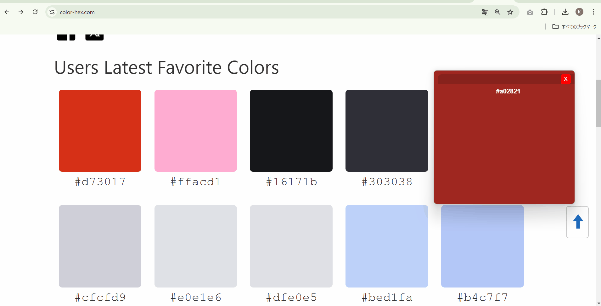

[](https://github.com/kazuma-naka/ironuki-gui/actions/workflows/build.yml)       

# Ironuki-GUI



**Ironuki-GUI** is a simple, minimalist GUI application for capturing the color under the mouse cursor and copying it to the clipboard in hex format. The app is designed to be lightweight and easy to use, with a clean and modern interface.

## Features

- Capture the color under your mouse cursor
- Automatically copy the captured color in hex format to the clipboard
- Display the color and its corresponding hex code in the GUI
- Keyboard shortcuts to control capturing:
  - `Ctrl+Shift+P` to pause capturing
  - `Ctrl+Shift+S` to start capturing
- Responsive design that resizes based on window dimensions
- Simple and minimalist UI
- Dark mode for better visual contrast

## Dependencies

This project uses the following key libraries:

- [robotjs](https://www.npmjs.com/package/robotjs): Used for precise mouse tracking and capturing the position of the cursor.
- [screenshot-desktop](https://www.npmjs.com/package/screenshot-desktop): Captures the screen in real-time to retrieve color information.
- [pngjs](https://www.npmjs.com/package/pngjs): Processes the captured screenshots to extract the hex color under the cursor.

## Installation

1. Clone this repository:
   ```bash
   git clone https://github.com/kazuma-naka/ironuki-gui.git
   ```
2. Navigate to the project directory:
   ```bash
   cd ironuki-gui
   ```
3. Install the dependencies:
   ```bash
   npm install
   ```
4. Run the application:
   ```bash
   npm start
   ```

or you can find installers [in here](https://github.com/kazuma-naka/ironuki-gui/releases)

## Usage

1. Launch the app.
2. The app window will show the current color under your mouse cursor.
3. Click anywhere within the window to copy the hex color code to your clipboard.
4. The app will display a toast notification confirming that the color has been copied.
5. Use `Ctrl+Shift+P` to pause color capturing, and `Ctrl+Shift+S` to start capturing again.

## Prerequisites

- [Node.js](https://nodejs.org/)
- [Electron](https://www.electronjs.org/)

## License

This project is licensed under the MIT License. See the [LICENSE](LICENSE) file for more details.

## Contributing

Contributions are welcome! Please feel free to submit a pull request or open an issue for any suggestions or bugs.

## Acknowledgments

- Built using [Electron](https://www.electronjs.org/).
- Uses [robotjs](https://www.npmjs.com/package/robotjs) for mouse tracking, [screenshot-desktop](https://www.npmjs.com/package/screenshot-desktop) for screen capture, and [pngjs](https://www.npmjs.com/package/pngjs) for image processing.
